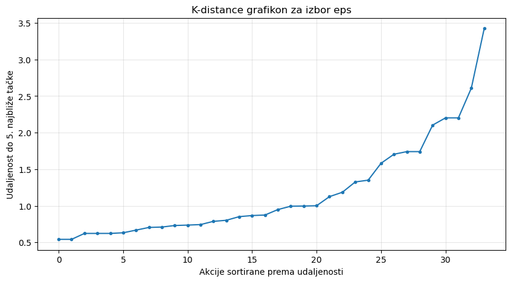
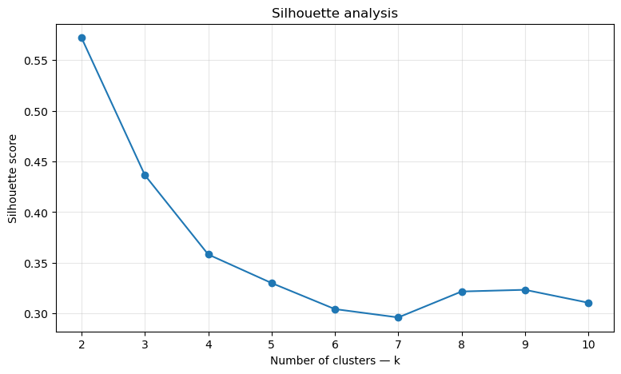
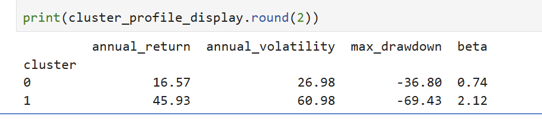

# Stock Clustering Using DBSCAN and K-Means

An unsupervised machine learning project that groups U.S. stocks according to their historical risk–return characteristics.

[Open the complete notebook](stock_clustering.ipynb)

## Project objective

The project investigates whether a diversified universe of stocks contains naturally occurring groups when each stock is represented by four historical financial features:

- annualized return
- annualized volatility
- maximum drawdown
- beta relative to the S&P 500 (`SPY`)

Two algorithms are compared:

- **DBSCAN** discovers dense regions and labels isolated observations as noise.
- **K-Means** assigns every stock to one of a specified number of clusters.

## Data and methodology

The notebook downloads five years of adjusted daily prices with `yfinance`. It then:

1. calculates the four financial features for each stock;
2. standardizes the feature matrix with `StandardScaler`;
3. uses a k-distance plot and sensitivity analysis to configure DBSCAN;
4. uses elbow and silhouette analyses to select the number of K-Means clusters;
5. interprets the cluster profiles in financial terms; and
6. projects the four-dimensional feature space into two PCA dimensions for visualization.

## Main findings

### DBSCAN

With `eps = 1.7` and `min_samples = 5`, DBSCAN identifies one main connected region and a small number of noise observations. The selected stocks therefore resemble a continuous risk–return spectrum rather than several clearly separated dense groups.

For this sample, DBSCAN is more useful for detecting unusual stock profiles than for forming multiple investment categories.



### K-Means

Silhouette analysis selects `k = 2` as the clearest partition. In the original run, the two average profiles were:

| Cluster | Annual return | Annual volatility | Maximum drawdown | Beta | Interpretation |
|---:|---:|---:|---:|---:|---|
| 0 | 16.57% | 26.98% | −36.80% | 0.74 | Moderate-risk, lower market sensitivity |
| 1 | 45.93% | 60.98% | −69.43% | 2.12 | Aggressive, high-risk/high-return |

The higher historical return of Cluster 1 was accompanied by substantially greater volatility, deeper drawdowns, and higher systematic risk.

Because the notebook uses a rolling five-year data window, exact values and cluster membership can change when it is rerun.





## DBSCAN vs K-Means

| Method | Output in this project | Most useful role |
|---|---|---|
| DBSCAN | One dense group plus noise stocks | Outlier detection |
| K-Means | Two broad stock groups | Complete segmentation |

These results are not contradictory. DBSCAN tests for separated dense regions, while K-Means imposes a partition into a specified number of groups.

## Limitations

- Results depend on the stock universe, feature selection, time window, and market regime.
- Historical returns are not forecasts of future returns.
- Volatility and beta estimates may change materially over time.
- Euclidean distance and equal feature weighting may not capture every form of financial similarity.
- Some features are correlated, potentially increasing the influence of related risk information.
- K-Means assumes centroid-based clusters; DBSCAN is sensitive to density parameters.
- Fundamentals, valuation, liquidity, transaction costs, and forward-looking information are excluded.

## Reproduce the analysis

From the repository root:

```bash
pip install -r requirements.txt
jupyter lab 01-stock-clustering/stock_clustering.ipynb
```

Run all notebook cells from top to bottom. Internet access is required to download Yahoo Finance data.

## Disclaimer

This project is educational and exploratory. It is not investment advice.
